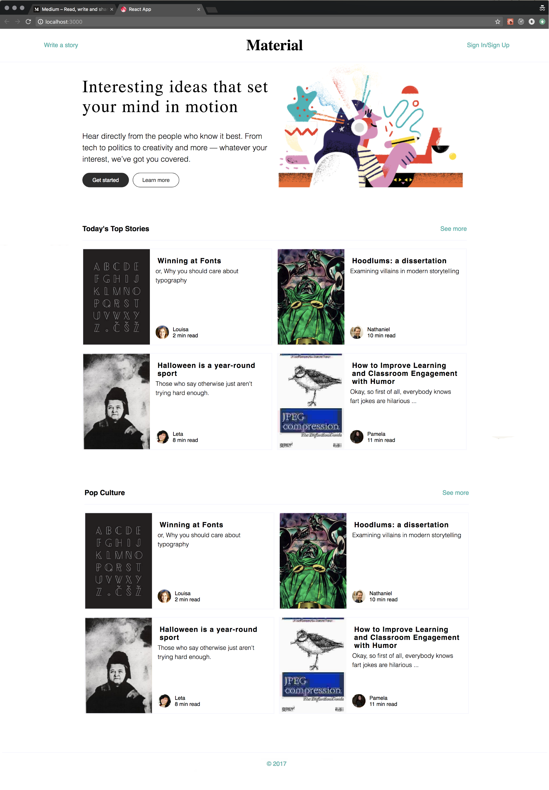
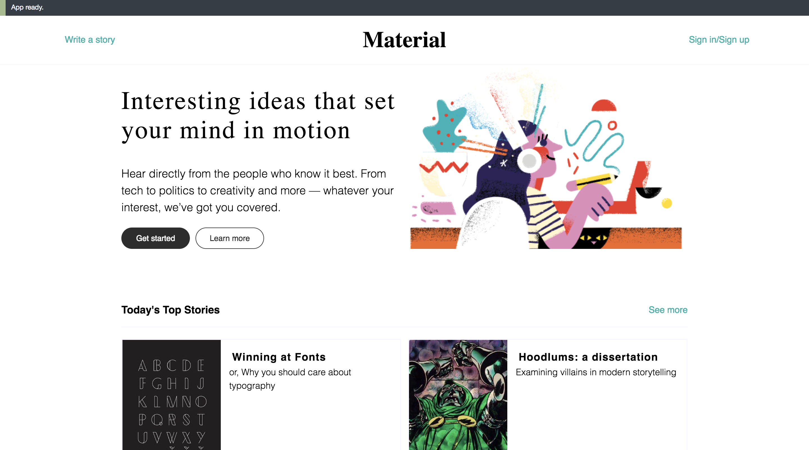
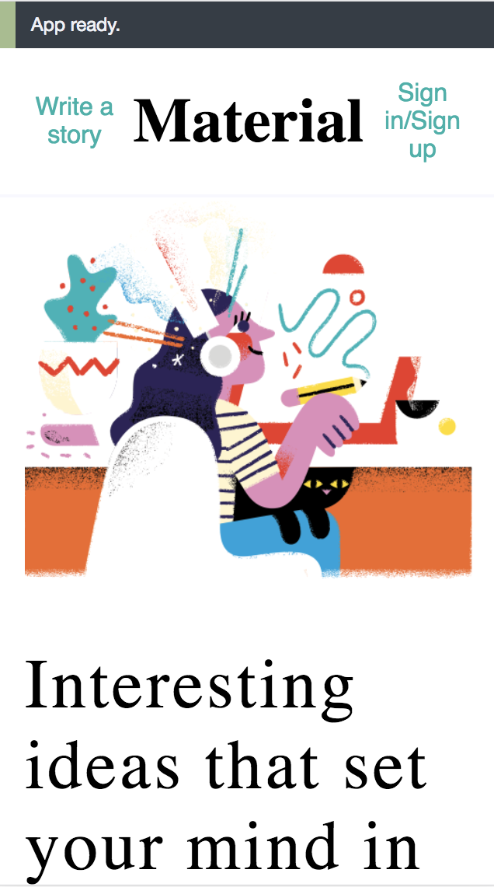

# React Static Comp - Alex Bonder - (FE Mod 2)

## Synopsis

  The job for this project was to replicate the design given to us in the comp and make it reponsive for both large and small screens while getting acclimated to React.

## Project Goals

* Learn to build a react app.
* Create modular, reusable React components.

## Installation

Fork or clone this project

Run `npm install` from the root directory

Run `npm start` and visit localhost:8080 in your browser

## ScreenShots

### Original Comp

### My Comp

#### Desktop View

#### Mobile View

